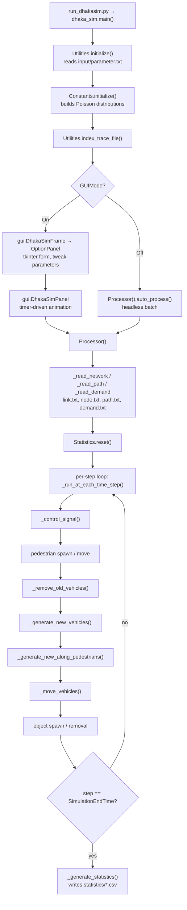

# DhakaSim (Python) — Codebase Analysis

**Deep Technical Guide & Scenario Extension Manual**

---

## Table of Contents

1. [Project Overview](#1-project-overview)
2. [The Strip Model](#2-the-strip-model)
3. [Architecture — How the Simulator Works](#3-architecture--how-the-simulator-works)
4. [Repository Layout](#4-repository-layout)
5. [Module Reference](#5-module-reference) · [5.5a Running more than once](#55a-running-more-than-once-per-session) · [5.6 One picture, two renderers](#56-one-picture-two-renderers)
6. [The Simulation Loop, Step by Step](#6-the-simulation-loop-step-by-step)
7. [Vehicle Generation & Demand](#7-vehicle-generation--demand)
8. [Vehicle Types](#8-vehicle-types)
9. [Car-Following Models](#9-car-following-models)
10. [Lane-Changing (Strip-Changing) Models](#10-lane-changing-strip-changing-models)
11. [Side Friction: Pedestrians & Roadside Objects](#11-side-friction-pedestrians--roadside-objects)
11a. [Networks, Time of Day & Survey Data](#11a-networks-time-of-day--survey-data)
11b. [GeometryMode: Medians & Roundabouts](#11b-geometrymode-medians--roundabouts)
12. [Intersections & Signals](#12-intersections--signals)
13. [Input File System](#13-input-file-system)
14. [Complete Parameter Reference](#14-complete-parameter-reference)
15. [Output Files & Metric Definitions](#15-output-files--metric-definitions)
16. [The Numeric Compatibility Layer](#16-the-numeric-compatibility-layer)
17. [Known Behaviours & Quirks](#17-known-behaviours--quirks)
18. [How to Simulate a New Location](#18-how-to-simulate-a-new-location)
19. [Road Diversions & Strip Blocking](#19-road-diversions--strip-blocking)
20. [Extension Recipes](#20-extension-recipes)
21. [Performance](#21-performance)
22. [Provenance & Validation](#22-provenance--validation)
23. [Quick Reference](#23-quick-reference)

---

## 1. Project Overview

**DhakaSim** is a specialised, event-based microscopic traffic simulator designed
to capture the non-lane-based and heterogeneous traffic common in developing
cities such as Dhaka, Bangladesh. Unlike traditional lane-based microscopic
simulators (SUMO, VISSIM) that assume vehicles follow single discrete lanes,
DhakaSim divides each road into many fine-grained **strips** (≈0.5 m wide).

Vehicles occupy several adjacent strips according to their physical width. That
single design decision is what makes the following behaviours emerge naturally
rather than needing special cases:

- **filtering** — a motorbike (2 strips) slipping between a bus (5 strips) and
  the kerb;
- **continuous lateral placement** — vehicles drift sideways strip by strip
  instead of snapping to lane centres;
- **side-friction bottlenecks** — parked cars, rickshaws and CNGs occupying the
  outer strips, permanently narrowing the usable carriageway;
- **mixed-speed interaction** — motorised traffic (car, bus, truck, CNG,
  motorbike) sharing strips with non-motorised traffic (rickshaw, pushcart,
  bicycle) and with pedestrians walking along and across the road.

This document describes the **Python implementation**, which is a faithful
translation of the original Java simulator; see
[Provenance & Validation](#22-provenance--validation).

**Key characteristics**

| Property | Value |
| --- | --- |
| Execution model | fixed time-step, 1 simulated second per step (`Constants.TIME_STEP`) |
| Spatial resolution | 0.5 m strips (`StripWidth`) |
| Vehicle types | 13 (including along-road pedestrians as "type 12") |
| Car-following models | 13 selectable |
| Lane-changing models | 4 selectable |
| Dependencies | none — standard library only, `tkinter` for the GUI |
| Python | 3.10+ |
| Code size | ~10,100 lines across 31 files |
| Bundled networks | 5 surveyed Dhaka junctions + the synthetic demo |

---

## 2. The Strip Model

Everything in DhakaSim is built on the strip. Understanding the indexing scheme
makes the rest of the codebase readable.

### 2.1 Strip allocation

A `Segment` of physical width `w` metres is divided into:

```
stripCount = 2 + floor((w - 2 × FootpathStripWidth) / StripWidth)
```

Index `0` and index `stripCount - 1` are **footpath strips** (pedestrians and
roadside objects live here first); everything between is carriageway. The
carriageway is then split into two directions of travel:

```
middleHighStripIndex = ceil(stripCount / 2)
middleLowStripIndex  = middleHigh - 1   if stripCount is even
                     = middleHigh - 2   if stripCount is odd
lastVehicleStripIndex = stripCount - 2
```

| Region | Strip range | Meaning |
| --- | --- | --- |
| Footpath (near) | `0` | pedestrians, parked objects |
| Direction A | `1 … middleLowStripIndex` | forward travel |
| Median | (odd `stripCount` only) `middleLow+1` | unused divider strip |
| Direction B | `middleHighStripIndex … lastVehicleStripIndex` | reverse travel |
| Footpath (far) | `stripCount - 1` | pedestrians, parked objects |

### 2.2 Worked example — the shipped Dhaka network

With `StripWidth 0.5` and `FootpathStripWidth 0.5`:

| Road width | Strips | Direction A | Direction B | Footpaths |
| --- | --- | --- | --- | --- |
| 24.5 m | 49 | 1 – 23 | 25 – 47 | 0, 48 |
| 27.0 m | 54 | 1 – 26 | 27 – 52 | 0, 53 |
| 32.0 m | 64 | 1 – 31 | 32 – 62 | 0, 63 |

A 27 m road therefore offers 26 strips per direction — enough for five buses
abreast, or thirteen motorbikes.

### 2.3 Vehicle footprint

```
numberOfStrips = ceil(vehicleWidth / StripWidth)
```

A vehicle at `stripIndex = k` occupies strips `k … k + numberOfStrips - 1`, and
registers itself in the vehicle list of every one of them
(`Vehicle._occupy_strips`). All neighbour searches — leader, follower, gap
checks, collision checks — iterate those strips. Leaving a strip is
`Vehicle.free_strips()`; a lateral move is `Vehicle._change_strip()`.

### 2.4 Longitudinal position

`distanceInSegment` is the position of the **tail** of the vehicle measured from
the segment start, so the head is at `distanceInSegment + length`. A vehicle
starts at `0.1` m and is considered at the segment end when

```
distanceInSegment + length + MARGIN >= segmentLength      (MARGIN = 1 m)
```

For a vehicle travelling in direction B (`reverseSegment = True`), the geometry
is mirrored when drawing and when comparing against pedestrian/object positions,
but `distanceInSegment` still counts up from that vehicle's own entry end.

---

## 3. Architecture — How the Simulator Works

### 3.1 Execution flow



### 3.2 Startup sequence

1. **`run_dhakasim.py`** puts the package on `sys.path` and calls
   `dhakasim.dhaka_sim.main()`.
2. **`Utilities.initialize()`** parses `input/parameter.txt` into the
   `Parameters` class attributes: strip geometry, pixel scaling, active
   behavioural models, and the random seed.
3. **`Constants.initialize()`** builds the two Poisson pedestrian-arrival
   distributions. This is deliberately separate from module import, because the
   distribution means come from `parameter.txt` and so cannot exist until step 2
   has run.
4. **`Utilities.index_trace_file()`** indexes `trace.txt` if `TraceMode On`, so
   the GUI's trace slider can seek to any step.
5. **Mode branching** on `Parameters.GUI_MODE` (overridable with `--headless` /
   `--gui`):
   - **GUI**: `DhakaSimFrame` shows `OptionPanel`; pressing *Start Simulation*
     applies the form values, creates `DhakaSimPanel`, and starts a
     `tkinter.after` timer that drives one step per tick.
   - **Headless**: `Processor().auto_process()` runs the loop to completion.
6. **`Processor.__init__`** reads the network, routes and demand, resets
   `Statistics`, creates `statistics/`, and computes the per-route generation
   schedule.

### 3.3 Layering

```
                  ┌──────────────────────────────────────┐
   presentation   │ gui.py  (tkinter: frame/form/canvas) │
                  └──────────────────┬───────────────────┘
                                     │
                  ┌──────────────────▼───────────────────┐
   engine         │ processor.py     (the per-step loop) │
                  └──────────────────┬───────────────────┘
                                     │
      ┌──────────────────────────────┼───────────────────────────────┐
      │                              │                               │
┌─────▼──────┐              ┌────────▼─────────┐            ┌────────▼────────┐
│  entities  │              │ network topology │            │   statistics    │
│ vehicle.py │              │ node / link /    │            │ statistics.py   │
│ pedestrian │◄────────────►│ segment / strip  │            │ vehicle_stats   │
│ roadside_… │  occupancy   │ intersection_…   │            └─────────────────┘
└─────┬──────┘              └────────┬─────────┘
      │                              │
      └──────────────┬───────────────┘
                     │
        ┌────────────▼─────────────┐
        │ utilities.py  constants  │  geometry, distributions, config
        │ parameters.py            │
        └────────────┬─────────────┘
                     │
        ┌────────────▼─────────────┐
        │ javacompat.py            │  exact numeric semantics + RNG
        └──────────────────────────┘
```

`javacompat.py` sits underneath everything: it supplies the arithmetic
primitives (`jmin`, `jround`, `jdiv`, `JavaRandom`, …) that the whole simulator
is built on. See [section 16](#16-the-numeric-compatibility-layer).

---

## 4. Repository Layout

```
DhakaSIM_python/
├── input/
│   ├── parameter.txt               all runtime settings (global, not per-network)
│   ├── junctions.txt               surveyed junction centres (lat/lon), reference
│   ├── demand-low/medium/high.txt  legacy alternative demand levels
│   ├── kakrail_corridor/           ── one folder per network ──
│   │   ├── link.txt                links and their segments (geometry, width)
│   │   ├── node.txt                intersections and boundary nodes
│   │   ├── node_names.txt          human-readable name per node (reports, GUI)
│   │   ├── path.txt                routes (link sequences) per OD pair
│   │   ├── demand.txt              vehicles/hour per OD pair (peak hour)
│   │   ├── demand_by_hour.txt      surveyed demand for all 24 hours
│   │   ├── vehicle_mix.txt         surveyed vehicle composition (peak hour)
│   │   ├── vehicle_mix_by_hour.txt surveyed composition for all 24 hours
│   │   └── geometry.txt            medians and roundabouts (GeometryMode)
│   ├── khamarbari/  banani_23/  banani_27/  bijoy_sarani/
│   └── demo_backup/                the original synthetic demo network
├── dhakasim/                       the simulator package
├── run_dhakasim.py                 launcher
├── run_sim.py                      route + demand generator (Floyd–Warshall)
├── tests/test_javacompat.py        numeric regression tests
├── Traffic Flow Data/              the survey workbooks the networks derive from
├── DhakaSIM Papers/                the published DhakaSim literature
├── README.md                       user-facing quick start
└── DhakaSIM_Python_Codebase_Analysis.{md,tex}   this document
```

Generated at run time (git-ignored): `statistics/` (CSVs under `statistics/csv/`,
HTML reports at `statistics/report_<timestamp>.html`), `trace.txt`, `debug/`.

The network is chosen by `Network` in `parameter.txt` or `--network` on the
command line. `Processor.input_path()` resolves each file inside the selected
folder and falls back to `input/<filename>` when the network does not provide
it; `parameter.txt` is deliberately *not* resolved that way — it is always read
from `input/parameter.txt` so one settings file governs every network.

---

## 5. Module Reference

### 5.1 Network topology layer

| Module | Lines | Purpose |
| --- | --- | --- |
| `node.py` | 365 | Intersections. Owns `IntersectionStripBundle`s (one per incoming link) that carry the signal state, the list of `IntersectionStrip`s (turn paths through the junction), and the vehicles currently inside the junction. Runs separating-axis collision detection between vehicles in the junction. A node with more than one link is a signalised junction; a node listed in `geometry.txt` becomes a **roundabout** and uses give-way priority instead of phases. |
| `link.py` | 57 | Connects two nodes (`upNode`, `downNode`); an ordered list of `Segment`s. |
| `segment.py` | 328 | A straight road stretch: start/end coordinates, width, the strip array, a mid-point sensor, and per-segment counters (throughput, average speed, waiting time, accidents). Computes the strip layout of [section 2](#2-the-strip-model), and under `GeometryMode` consumes centre strips for a physical median. |
| `strip.py` | 539 | The spatial unit. Holds the vehicle, pedestrian and object lists occupying it, and answers every neighbour query: `probable_leader`, `probable_follower`, `probable_object_leader`, `has_gap_for_adding_vehicle`, `has_gap_for_strip_change` (which is where the lane-changing models live), `get_gap_for_forward_movement`, `has_collision_occurred`, `check_for_accident`. |
| `intersection_strip.py` | 90 | One turn path across a junction: entry strip → exit strip, with the two pixel-space endpoints that define its centre line. Inside a roundabout the path is bent into a clockwise arc (`set_arc`, `point_at`, `is_curved`) and `get_length()` returns arc length, so going round the island genuinely costs more distance than cutting across it. |
| `intersection_strip_bundle.py` | 58 | All turn paths that *enter* the junction from one link, sharing a single signal state. Signal control operates on bundles, not on individual turns. |
| `link_segment_orientation.py` | 45 | Given a point and a link, decides whether the vehicle traverses the link forwards or backwards (`reverseLink`) and whether the segment itself is entered from its start or its end (`reverseSegment`). Everything directional keys off these two flags. |

### 5.2 Traffic entity layer

| Module | Lines | Purpose |
| --- | --- | --- |
| `vehicle.py` | 2,315 | The main entity. Physical properties from type; longitudinal control (13 car-following models); lateral control (strip changing); junction traversal including deadlock escape; fuel consumption; collision/accident bookkeeping; drawing geometry. |
| `pedestrian.py` | 218 | A **road-crossing** pedestrian: moves laterally across the strips one at a time (`move_forward`), and can shuffle longitudinally (`move_length_wise`) when blocked. Removed on reaching the far side or when stuck for longer than `segmentWidth / speed`. |
| `roadside_object.py` | 207 | A stationary side-friction element: standing pedestrian, parked car, parked rickshaw, parked CNG. Occupies a contiguous block of strips from the footpath inwards for a randomly drawn parking duration. |

Pedestrians walking **along** the road are not `Pedestrian` objects — they are
`Vehicle`s of type 12 with a 0.4 m × 0.4 m footprint. This lets them participate
in car-following and strip-changing like any other road user.

### 5.3 Simulation engine layer

| Module | Lines | Purpose |
| --- | --- | --- |
| `processor.py` | 1,699 | The engine. Network/route/demand parsing, per-step orchestration, vehicle and pedestrian and object generation, signal control, junction entry/exit, flow measurement, and final statistics output. |
| `parameters.py` | 120 | Every runtime setting as class attributes (Java `static` fields), plus the three model enumerations. |
| `constants.py` | 160 | Fixed physical constants, colours, and the empirical Gaussian-mixture blockage distributions for the four roadside object types, derived from Dhaka field survey data. |
| `statistics.py` | 60 | Global accumulators, reset per run. |
| `vehicle_stats.py` | 37 | Per-vehicle speed and trajectory time series (only written out when `Processor.write_speed()` is enabled). |
| `report.py` | 390 | Builds a self-contained HTML report after every run: per-type table, inline SVG bar charts, plain-language explanation of each metric, and the embedded animation from `visualize.py`. No third-party dependencies. |
| `visualize.py` | 355 | Captures `ReportAnimationFrames` frames during the run and emits an inline animated SVG (a pure-CSS flip-book) plus a static snapshot for the report. Reuses the simulator's own drawing geometry through an SVG-emitting graphics backend. |
| `dhaka_sim.py` | 50 | Entry point: initialise, apply `--network` / `--hour` / `--gui` / `--headless`, then branch on GUI mode. |

### 5.4 Support layer

| Module | Lines | Purpose |
| --- | --- | --- |
| `utilities.py` | 669 | Parameter file parsing; 2-D geometry helpers (`return_x3` … `return_y6` compute perpendicular offsets used for road and vehicle corners); the error function and Gaussian CDF; per-type vehicle dimensions and performance; blockage sampling from the Gaussian mixtures; the strip-weight function used by the strip-based car-following model. |
| `javacompat.py` | 640 | Exact numeric semantics and the seeded RNG. See [section 16](#16-the-numeric-compatibility-layer). |
| `demand.py` | 40 | An OD pair with its flow rate and the routes serving it. |
| `path.py` | 33 | A route: source node, destination node, ordered link ids. |
| `point2d.py`, `signal.py`, `normal_distribution.py` | 14 / 16 / 39 | A mutable 2-D point; the `RED`/`GREEN`/`YELLOW` enum; a single Gaussian component of a mixture. |

### 5.5 Presentation & tooling

| Module | Lines | Purpose |
| --- | --- | --- |
| `gui.py` | 908 | `DhakaSimFrame` (window), `OptionPanel` (parameter form), `DhakaSimPanel` (animated canvas), and `CanvasGraphics` — an adapter that applies the pan/zoom transform and draws onto a `tkinter.Canvas`. Also writes and replays `trace.txt`. |
| `road_geometry.py` | 217 | **The single road painter.** Builds the segment quads, junction hull patches and roundabout island discs, and paints road surface, kerb outlines, junction patches and islands onto any graphics surface. Called by both `gui.py` and `visualize.py`, so the live animation and the report's animation are the same picture — see [section 5.6](#56-one-picture-two-renderers). |
| `run_sim.py` | 371 | Floyd–Warshall route generator: builds the node adjacency from `link.txt`/`node.txt`, computes shortest paths between all boundary node pairs, and writes `path.txt` + `demand.txt` into the selected network's folder. Refuses to overwrite a survey network's measured demand unless `--force`; `--paths-only` regenerates routes alone. |
| `tests/test_javacompat.py` | 131 | Pins the numeric layer to reference values. |

---

### 5.5a Running more than once per session

`DhakaSimFrame` can go back to the setup form and start another run, which is
what the **◀ New simulation** button in the simulation toolbar does. That only
works if a second `Processor` really is a fresh start, and several pieces of
state are process-wide:

| State | How it is reset |
| --- | --- |
| Every `Parameters` field | `DhakaSimFrame` snapshots the configuration once, straight after `Utilities.initialize()`, and `show_options()` restores it. Needed because a run mutates it: the form converts `MaximumSpeed` from km/h, `EncounterPerAccident` is transformed again, `along_pedestrian_mode` is left wherever the 20-step toggle stopped, and `GeometryMode` fills in the median and roundabout tables |
| `Parameters.simulation_step` | set back to 1 by `show_options()` |
| `Processor`'s roadside-object counters | zeroed in `Processor.__init__`; they are class-level (Java `static`), and a fresh JVM always started them at zero |
| `Strip._rand` | cleared in `Processor.__init__` so the strips capture the new run's generator instead of the previous one's |
| `Statistics` | already reset per run by `Statistics.reset()` |
| The timer and `trace.txt` | released by `DhakaSimPanel.dispose()` |

With every unseeded source switched off, running the same seeded scenario twice
in one process gives byte-identical results. With side friction on the runs
differ, as they should — pedestrian arrivals and roadside objects are sampled
from clock-seeded generators ([section 17.1](#17-known-behaviours--quirks)) —
but the object population still starts from zero each time.

### 5.6 One picture, two renderers

The GUI is what you watch while a run is in progress; the report's embedded
animation is what everybody else sees afterwards. Those have to be the same
picture, so neither the shapes nor the colours are duplicated:

- **Geometry** lives only in `road_geometry.py`. `build()` returns the segment
  quads, junction hulls and island discs; `paint()` draws them in the order that
  makes an intersection read as one smooth area (surfaces → kerbs → junction
  patches on top → islands last). `gui.py` and `visualize.py` both call it.
- **Colours** come only from `Constants` (`road_fill_color`,
  `island_fill_color`, `road_border_color`, `background_color`).
- **Scale** is handled by the graphics surface, not by the geometry. Everything
  is built in *simulation pixel space* — metres × `PixelPerMeter`, the space
  `IntersectionStrip` endpoints and vehicle bodies already live in — and each
  backend applies one uniform transform on the way out: an `AffineTransform` in
  the GUI, a scale-and-translate in the SVG writer. Building at one scale and
  scaling once is what makes the two outputs congruent rather than merely
  similar.
- **Vehicles** are drawn by `Vehicle.draw_vehicle()` in both, with the real
  `Parameters.pixel_per_strip` / `pixel_per_meter` / `pixel_per_footpath_strip`.
  That matters for vehicles inside a junction, whose position comes from the
  `IntersectionStrip` arc built at the simulation scale.

Only the report's own chrome — node name labels with leader lines, the north
arrow, the scale bar — is drawn in output pixels with its own palette, because
the simulation has no equivalent of it.

## 6. The Simulation Loop, Step by Step

`Processor._run_at_each_time_step()` executes exactly this order once per
simulated second. **The order matters** — several stages depend on state written
by an earlier one.

| # | Call | What happens |
| --- | --- | --- |
| 1 | `_control_signal()` | Only when `step % SignalChangeDuration == 0`. Advances the green bundle at every signalised node. |
| 2 | *(along-pedestrian toggle)* | If along-pedestrian mode was on at startup, `Parameters.along_pedestrian_mode` flips every 20 steps, producing alternating 20-second bursts of footpath pedestrian traffic. |
| 3 | `_remove_old_pedestrians()`<br>`_generate_new_pedestrians()`<br>`_move_pedestrians()` | Only when `AcrossPedestrianMode On`. Drop finished pedestrians, Poisson-spawn new ones per link, then move each one laterally (or longitudinally if blocked). |
| 4 | `_remove_old_vehicles()` | Vehicles flagged `toRemove` free their strips, contribute to trip statistics, and leave the list. |
| 5 | `_generate_new_vehicles()` | For every route whose next generation time has arrived, spawn vehicle(s) and schedule the next arrival. |
| 6 | `_generate_new_along_pedestrians()` | Only while `along_pedestrian_mode` is currently true. Poisson-spawns type-12 pedestrian "vehicles". |
| 7 | `_move_vehicles()` | The main movement pass — see below. |
| 8 | `_generate_new_objects()`<br>`_remove_old_objects()` | Only when `ObjectMode On`. Spawn parked vehicles / standing pedestrians, then release those whose parking time has expired. |

### 6.1 Inside `_move_vehicles()`

For each vehicle, in list order (which is creation order):

```
if PenaltyWait and vehicle already collided:
    if penalty time elapsed: remove from simulation
    skip this vehicle
if vehicle is inside a junction:
    free its strips (it is not on a segment)
    if at junction exit:  move_vehicle_at_intersection_end()   # enter next link
    else:                 move_vehicle_in_intersection()
                          then re-check for arrival at the exit
else:
    look up the signal ahead and store it on the vehicle
    if at segment end:    move_vehicle_at_segment_end()        # next segment, or junction
    else:                 move_vehicle_at_segment_middle()     # ordinary driving
                          then re-check for arrival at the end
increment fuel consumption; record speed and position
```

Then two separate passes over all vehicles:

1. `accident_log_all_vehicle_at_last()` — appends a row to
   `statistics/accident_log.csv` for any vehicle that has collided or struck a
   pedestrian.
2. `accident_check_all_vehicles_at_last()` — intended to apply the collision
   penalty. See [quirk 17.5](#17-known-behaviours--quirks): in practice it never
   fires, because the check in pass 1 consumes the pedestrian.

Finally, every 60 steps the minute's `flowCount` is written into
`Statistics.flow` and reset.

### 6.2 Ordinary driving — `Vehicle.move_vehicle_in_segment()`

For everything except type-12 pedestrians:

```python
if is_object_in_proximity() or not move_forward_in_segment() or is_slower_vehicle_in_proximity():
    try_lane_change(priority_towards_middle=True)
```

Read it as: *if a parked object is ahead, or I could not move forward at all, or
my leader is slower than I want to go — try to change strips.* The three
conditions are evaluated left to right and `move_forward_in_segment()` has the
side effect of actually moving, so the ordering is load-bearing. A lane change is
attempted towards the road centre first, then towards the kerb — except that a
vehicle will not move towards the kerb when a parked object is there.

Type-12 pedestrians take a different branch: with probability
`PedestrianRandomLaneChangePercentage`/101 they attempt a random lateral move
(biased left with probability `PedestrianLeftBiasPercentage`/101), otherwise they
walk forward and only swerve if blocked.

### 6.3 Moving forward — `Vehicle._move_forward_in_segment()`

1. `_control_speed_in_segment()` picks the new speed from the active
   car-following model, clamps it to `currentMaxSpeed`, and — if `BrakeHard On` —
   further clamps it to the smallest actually-available gap across all occupied
   strips.
2. If the speed is usable, the position advances by **Butcher's fifth-order
   quadrature** rather than `x + v·Δt`:

   ```
   Δv = v_new − v_old
   k₁ = v_old,  k₃ = v_old + 0.25Δv,  k₄ = v_old + 0.50Δv,
   k₅ = v_old + 0.75Δv,  k₆ = v_new
   x_new = x + (1/90)(7k₁ + 32k₃ + 12k₄ + 32k₅ + 7k₆)·Δt
   ```

3. The position is capped so the vehicle never overruns the segment end, and the
   mid-segment sensor flag is updated the first time it is passed.
4. If the speed was zero, `waitingTime` and `waitingTimeInSegment` both
   increment — this is what the waiting-time statistics measure.

---

## 7. Vehicle Generation & Demand

### 7.1 From `demand.txt` to a spawn schedule

`Processor._read_demand()` reads `source dest vehiclesPerHour` and stores
**`vehiclesPerHour + 30`** — a hard-coded offset applied to every route, so a
file value of 100 becomes an effective 130 veh/h.

For each route:

```
demandRatio = 3600 / demand
vehiclesToGenerate = 1                       if demandRatio > 1
                   = round(1 / demandRatio)  otherwise
nextGenerationTime = 1
```

`vehiclesToGenerate` only exceeds 1 for demands above 3600 veh/h, so with normal
inputs one spawn attempt is made per arrival event.

### 7.2 Arrival process

`_generate_new_vehicles()` fires when `nextGenerationTime` equals the current
step, then repeats until the next arrival falls in a later step:

| `VehicleGenerationRate` | Headway |
| --- | --- |
| `0` — CONSTANT | `X = 3600 / demand` (deterministic) |
| `1` — POISSON | `X = (3600 / demand) · (−ln U)`, `U ~ Uniform(0,1)` — exponential inter-arrival times, i.e. a Poisson process |

### 7.3 Placing the vehicle

`_create_a_vehicle()`:

1. Pick a route uniformly among those serving the OD pair.
2. Pick a vehicle type from the mix (below).
3. Resolve the entry segment and its orientation, then the legal strip window for
   the travel direction (`1 … middleLow` or `middleHigh … lastVehicle`).
4. Pick a random start strip in that window, then scan **upwards** for a strip
   run wide enough and clear enough for the vehicle
   (`has_gap_for_adding_vehicle`, which requires the first
   `THRESHOLD_DISTANCE + 0.08 + length` metres to be free of vehicles, objects
   and pedestrians). If nothing is found, scan **downwards**.
5. If no gap exists anywhere, the vehicle is simply **not created** — demand is
   lost rather than queued. This is how the model saturates.

### 7.4 Vehicle type mix

`_distributed_vehicle_type()` draws `ratio = randomInt(0..100)` and, after the
percentage split is forced to slow 25 / medium 25 / fast 50, resolves to:

| Band | Probability | Sub-draw | Type |
| --- | --- | --- | --- |
| Slow (`ratio < 25`) | ~24.8 % | `< 9` | 0 bicycle |
| | | `9 … 97` | 1 rickshaw |
| | | `≥ 98` | 2 van / pushcart |
| Medium (`25 ≤ ratio < 50`) | ~24.8 % | `< 83` | 7 CNG |
| | | `83 … 97` | 8–9 bus |
| | | `≥ 98` | 10–11 truck |
| Fast (`ratio ≥ 50`) | ~50.5 % | `< 88` | 3 motorbike |
| | | `≥ 88` | 4–6 car |

The result is a heavily rickshaw- and motorbike-dominated stream, which is the
point: it reproduces observed Dhaka composition rather than a Western vehicle
mix. Three alternative mixes are present but unused —
`_distributed_vehicle_type_miami()`, `_distributed_vehicle_type_bd_new()`,
`_random_vehicle_type()` — and can be swapped in at
`_pedestrian_vehicle_distribution_type()`.

---

## 8. Vehicle Types

Defined in `utilities.py` (`_CAR_WIDTHS`, `_CAR_LENGTHS`, `_CAR_SPEEDS`,
`_CAR_ACCELERATIONS`). Maximum braking is −6 m/s² for every type.

| Type | Vehicle | Width (m) | Length (m) | Strips @0.5 m | Max speed (km/h) | Max speed (m/s) | Accel (m/s²) |
| --- | --- | --- | --- | --- | --- | --- | --- |
| 0 | bicycle | 0.55 | 1.90 | 2 | 15 | 4.1666 | 0.42 |
| 1 | rickshaw | 1.20 | 2.40 | 3 | 8 | 2.2222 | 0.25 |
| 2 | van / pushcart | 1.22 | 2.50 | 3 | 7 | 1.9444 | 0.20 |
| 3 | motorbike | 0.60 | 1.80 | 2 | 100 | 27.7777 | 2.80 |
| 4 | car | 1.70 | 5.00 | 4 | 100 | 27.7777 | 3.00 |
| 5 | car | 1.76 | 4.55 | 4 | 60 | 16.6666 | 2.80 |
| 6 | car | 1.78 | 4.30 | 4 | 110 | 30.5555 | 3.34 |
| 7 | CNG (auto-rickshaw) | 1.40 | 2.65 | 3 | 40 | 11.1111 | 1.11 |
| 8 | bus | 2.40 | 10.30 | 5 | 30 | 8.3333 | 0.84 |
| 9 | bus | 2.30 | 9.50 | 5 | 40 | 11.1111 | 1.12 |
| 10 | truck | 2.44 | 7.20 | 5 | 35 | 9.7222 | 0.96 |
| 11 | truck | 2.46 | 7.50 | 5 | 45 | 12.5000 | 1.24 |
| 12 | pedestrian (along road) | 0.40 | 0.40 | 1 | 5.1 | 1.4166 | 0.10 |

Two details:

- The effective ceiling is `min(MaximumSpeed, typeMaxSpeed)`, so the network
  speed limit can bind before the vehicle's own capability does.
- Type 12 gets **per-individual variation**: its max speed and acceleration are
  each perturbed by a Gaussian with σ = mean/5, so a crowd of walkers has a
  realistic speed spread.

---

## 9. Car-Following Models

Selected by `CF_model` in `input/parameter.txt`. All are implemented in
`vehicle.py`; each returns a new speed, from which acceleration is back-computed
as `(v_new − v_old)/Δt`.

| `CF_model` | Model | Method |
| --- | --- | --- |
| 0 | **HYBRID** (default) | `_get_new_speed_gipps_model` |
| 1 | NAIVE | inline — accelerate at maximum, ignore everything |
| 2 | GIPPS | `_get_new_speed_gipps_model` |
| 3 | KRAUSS | `_get_new_speed_krauss_model` |
| 4 | GFM (generalised force) | `_get_new_speed_gfm_model` |
| 5 | IDM (intelligent driver) | `_get_new_speed_idm_model` |
| 6 | RVF (reduced visual field) | `_get_new_speed_rvf_model` |
| 7 | VFIAC | `_get_new_speed_vfiac_model` |
| 8 | OVCM (optimal velocity, memory) | `_get_new_speed_ovcm_model` |
| 9 | KFTM | `_get_new_speed_kftm_model` |
| 10 | HDM (human driver, multi-leader) | `_get_new_speed_hdm_model` |
| 11 | SBM (stochastic behavioural) | `_get_new_speed_sbm_model` |
| 12 | **MY_MODEL** (strip-based, weighted) | `_get_new_speed_my_model` |

### 9.1 Gap definition

Every model works from the same gap, in `Vehicle.get_gap()`:

```
Δx = x_leader − THRESHOLD_DISTANCE − (x_follower + length_follower)
```

i.e. bumper-to-bumper clearance minus a 0.5 m standstill buffer. Note the gap
can go **negative**, which is how overlaps (collisions) are detectable.

When `ErrorMode On`, `get_dx()` instead returns a *perceived* gap corrupted by
sensor error — radar error for the immediate leader, GPS position error for
further leaders — controlled by `FTMethod`, `NoOfReadings` and `MFactor`. This
supports connected/automated-vehicle experiments.

### 9.2 Gipps / hybrid (the default)

Free-flow branch — how fast the driver *wants* to go:

$$v_a = v_n + 2.5\,a_n T \left(1 - \frac{v_n}{V_n}\right)\sqrt{0.025 + \frac{v_n}{V_n}}$$

Car-following branch — the fastest speed from which the driver can still stop
safely behind the leader:

$$v_b = d T + \sqrt{d^2T^2 - d\left(2\Delta x - v_n T - \frac{v_{n-1}^2}{\hat d}\right)}$$

where $d$ is the follower's maximum braking (−6 m/s²), $T$ the reaction time
(= 1 s = one time step), and $\hat d = (d_{leader} + d_{follower})/2$ the
follower's estimate of the leader's deceleration.

The new speed is `precision2(max(0, min(v_a, v_b)))`.

> **Important:** the square root argument goes negative whenever the leader is
> too close to stop behind, making $v_b$ **NaN**. Java's `Math.min`/`Math.max`
> propagate NaN, so `max(0, min(v_a, NaN))` is NaN, which `precision2` then
> truncates to **0** — an emergency stop. This is a load-bearing behaviour, not
> an accident; see [section 16](#16-the-numeric-compatibility-layer).

The difference between GIPPS and HYBRID is only meaningful together with
`BrakeHard`, which adds a hard gap-based clamp on top of the model speed.

### 9.3 MY_MODEL — the strip-aware model

This is the model designed for non-lane traffic, and the only one that uses the
strip structure rather than treating the road as a single lane.

1. **Free speed**: `v_a = min(currentMaxSpeed, v + a·Δt)`.
2. **Local density**: count distinct vehicles and pedestrians within the
   vehicle's own strips widened by `±numberOfStrips`, over the longitudinal
   window `[x, x + 2·length]`, divided by 9.
3. **Adaptive attention**: if `density/10 < DensityPercentage/100`, the driver
   ignores adjacent strips (`sideStrips = 0`); otherwise it considers
   `SideStripsToConsider = 1` strip on each side. In free flow you watch only
   your own path; in congestion you watch your neighbours.
4. **Congested speed** over all leaders found in the attention window:
   - `ConsiderMinimum On` → the **minimum** Gipps braking speed over all
     leaders (conservative);
   - `ConsiderMinimum Off` → a **weighted average**, where each leader's weight
     is its lateral overlap with the follower × a normalised centrality term ×
     a type weight (`PedestrianWeight` for pedestrians, 1 otherwise), capped by
     the closest leader's speed.

   The weight function is `Utilities.get_weight()`: a leader that only clips the
   edge of your path restrains you less than one squarely in front.

### 9.4 The remaining models

Each is a faithful implementation of its published form, retained for the
comparative studies the simulator was built for:

- **KRAUSS** — safe-velocity formulation with a τ = 0.3 s reaction time.
- **GFM** — generalised force model; separate attraction and repulsion ranges
  (`Ra = 15 m`, `Rd = 80 m`).
- **IDM** — desired dynamic gap `s* = s₀ + max(0, vT + vΔv/(2√ab))`, with
  `a = 3`, `b = 4`, `T = 1.5 s`, acceleration exponent 4.
- **RVF / VFIAC** — optimal-velocity variants that average the leader's speed
  over a 4-step memory window (`TIME_WINDOW`).
- **OVCM** — optimal-velocity with a 3-step gap memory (`GAP_WINDOW`).
- **KFTM** — combines an IDM-like and a Gipps-like speed and takes the minimum,
  evaluated over up to three leaders within 300 m; tuned by `ALPHA`, `BETA`,
  `ETA`.
- **HDM** — human driver model with explicit multi-leader interaction over four
  leaders.
- **SBM** — stochastic behavioural model with Gaussian noise on the desired
  spacing.

When no leader exists, the vehicle follows a **dummy leader**: a stopped
zero-length vehicle at the link end if the vehicle is in the last segment
(speed 0 on red, 5 m/s on green), or a vehicle at 100,000,000 m travelling at
the speed limit otherwise. This is how signals brake traffic without any
special-casing in the car-following code.

---

## 10. Lane-Changing (Strip-Changing) Models

Selected by `DLC_model`. The decision is made in
`Strip.has_gap_for_strip_change()`, which is called for the target strip.

A move is only considered if the target strip is geometrically free: no vehicle
whose extent (± threshold) overlaps the mover's, and no pedestrian inside its
footprint. Beyond that:

| `DLC_model` | Model | Rule |
| --- | --- | --- |
| 0 | **NAIVE** (default) | Geometric clearance is sufficient — change immediately. |
| 1 | GHR | Feasible if the General-Motors/GHR acceleration with respect to the new leader (and of the new follower with respect to you) stays above maximum braking. |
| 2 | GIPPS | Feasible if the required deceleration for you *and* for the prospective follower stays above maximum braking. |
| 3 | MOBIL | Accept if the new follower's acceleration stays above `b_safe = −4 m/s²` **and** the politeness-weighted total acceleration gain exceeds `a_th = 0.1 m/s²`. |

For GHR and GIPPS an additional **gap-acceptance probability** is applied:

$$P = 1 - e^{-\lambda (t_{gap} - t_{safe})}, \qquad \lambda = 0.78$$

evaluated for both the lead and lag gaps and multiplied together; the change
happens only if a uniform draw falls below `P`. This makes lane changing
stochastic rather than deterministic.

The manoeuvre itself (`_move_to_higher_index_lane` / `_move_to_lower_index_lane`)
walks one strip at a time towards the limit for the travel direction, and rolls
back to the original strip if it cannot find a position from which it can also
move forward.

Type-12 pedestrians always use NAIVE regardless of `DLC_model`
(`Utilities.get_dlc_model`).

---

## 11. Side Friction: Pedestrians & Roadside Objects

This is what distinguishes DhakaSim from lane-based simulators, and the
distributions below come from field surveys in Dhaka.

### 11.1 Road-crossing pedestrians (`AcrossPedestrianMode`)

- **Arrival**: per link, per step, a Poisson draw with mean
  `AcrossPedestrianPerHour / 3600` (default 400/3600 ≈ 0.111 per link-second).
- **Longitudinal position**: a three-zone mixture over the crossable range
  `[9 m, length − 9 m]`. The range is split into its **first 20 %, middle 60 %
  and last 20 %**, drawn with probabilities **0.4 / 0.2 / 0.4** — so 80 % of
  crossings happen in the 40 % of the block nearest the two junctions, which is
  what is observed on the ground.
- **Speed**: 0.05 or 0.15 m/s (chosen uniformly) — deliberately slow, because
  this value is the lateral progress per second across the strips.
- **Side**: the near or far footpath, uniformly.
- **Movement**: `move_forward()` advances laterally into the next strip if that
  strip has a gap; if blocked, `move_length_wise()` shuffles along the road
  instead. A pedestrian stuck longer than `segmentWidth / speed` is removed.
- **Effect on traffic**: a pedestrian inside a vehicle's braking envelope forces
  `get_gap_for_forward_movement()` to return 0 — a full stop — and a pedestrian
  inside a vehicle's footprint registers an accident.

### 11.2 Along-road pedestrians (`AlongPedestrianMode`)

Spawned as type-12 vehicles with a Poisson mean of
`AlongPedestrianPerHour / 3600` per route per step. Their initial strip comes
from the *walking pedestrian* blockage distribution, so they cluster near the
kerb but stray into the carriageway realistically. Because they are vehicles,
they follow, overtake and get overtaken like everything else, and they are
weighted by `PedestrianWeight` when other road users decide how much to respect
them.

Note the 20-step on/off toggle described in
[section 6](#6-the-simulation-loop-step-by-step): footpath pedestrian traffic
arrives in bursts, not steadily.

### 11.3 Roadside objects (`ObjectMode`)

Four types, each with an empirically fitted **mixture of Gaussians** for how far
into the carriageway it protrudes (`constants.py`):

| Type | Object | Length × Width (m) | Blockage range (m) | Mixture components | Target count |
| --- | --- | --- | --- | --- | --- |
| 1 | standing pedestrian | 0.7 × 0.7 | 0.21 – 6.00 | 5 | 60 |
| 2 | parked car | 4.5 × 1.7 | 0.70 – 6.00 | 6 | 76 |
| 3 | parked rickshaw | 3.0 × 1.0 | 0.56 – 6.00 | 5 | 60 |
| 4 | parked CNG | 2.6 × 1.3 | 0.95 – 4.67 | 4 | 18 |
| 5 | *walking* pedestrian | — | 0.50 – 7.75 | 2 | (used for type-12 placement) |

Target counts are `ceil(rate × TOTAL_NETWORK_ROAD_LENGTH)` with
`TOTAL_NETWORK_ROAD_LENGTH = 3.83` km.

- **Spawn probability** per link per step is
  `factor × k × (1 − Φ(currentCount; targetCount, 10))` with `factor = 0.1` and
  `k` = 3, 1, 4, 7 for the four types. As the population approaches its target
  the Gaussian CDF drives the spawn rate towards zero, so counts self-regulate
  around the surveyed density instead of growing without bound.
- **Placement**: a random segment, a random longitudinal position in
  `[9, length − 9]`, a random side, and a blockage depth drawn from the mixture.
  The object occupies every strip from the footpath up to its blockage depth —
  and is rejected outright if any of them lacks a 0.5 m clear gap.
- **Parking duration**, drawn uniformly:

  | Object | Duration |
  | --- | --- |
  | standing pedestrian | 10 – 60 s |
  | parked car | 100 – 500 s |
  | parked rickshaw | 30 – 150 s |
  | parked CNG | 60 – 300 s |

  When it expires, the object frees its strips and disappears.
- **Effect on traffic**: `is_object_in_proximity()` is the *first* condition in
  the movement decision, so an approaching object triggers a strip change before
  any car-following consideration — and a vehicle will never change strips
  *towards* an object.

---

## 11a. Networks, Time of Day & Survey Data

### Selecting a network

`Network` in `parameter.txt` (or `--network <name>` on the command line) names a
folder under `input/`. Five networks are built from real intersection surveys in
the `Traffic Flow Data/` workbooks, and `demo_backup/` holds the original
synthetic network the port was validated against:

| Network | Junction | Notes |
| --- | --- | --- |
| `kakrail_corridor` | Kakrail Church + Kakrail Mosque | two-junction corridor; the Church is a roundabout, r = 16.3 m |
| `khamarbari` | Khamar Bari Goal Chottor | roundabout, r = 28.8 m; two dual carriageways with medians |
| `banani_23` | Banani 23 / Super Market | |
| `banani_27` | Banani 27 / Kacha Bazar | Kamal Ataturk Ave dual carriageway |
| `bijoy_sarani` | Bijoy Sarani | |
| `demo_backup` | synthetic | 23 links, 110 routes; the Java-parity reference |

`input/junctions.txt` records the surveyed junction centres in WGS84 as
provenance for the coordinates, and supersedes the GPS fields inside the
workbooks (which were wrong for Banani 23 and Bijoy Sarani).

### Node names

`node_names.txt` maps each node id to a street name (`0 Indira Road`). Purely
cosmetic — it makes the HTML report and the GUI readable instead of numeric.

### Time of day

Survey networks carry demand and vehicle composition for all 24 hours:

- `demand_by_hour.txt` — `hour source destination vehiclesPerHour` per line
- `vehicle_mix_by_hour.txt` — `hour vehicleType percentage` per line

`TimeOfDay` in `parameter.txt`, or `--hour <0-23>`, selects the hour. The
default `-1` means *peak hour*, which falls back to the flat `demand.txt` and
`vehicle_mix.txt`. This is what makes a diurnal study possible:

```bash
python run_dhakasim.py --headless --network khamarbari --hour 8    # morning peak
python run_dhakasim.py --headless --network khamarbari --hour 14   # midday
```

### Surveyed vehicle composition

`vehicle_mix.txt` is `vehicleType percentage` per line, e.g. for Khamarbari:

```
0 2.231     bicycle
1 8.572     rickshaw
2 0.761     van / cart
3 29.266    motorbike
4 33.780    car
7 20.994    CNG
8 2.491     bus
10 1.906    truck
```

When present it replaces the built-in 25/25/50 distribution of
[section 7.4](#74-vehicle-type-mix) entirely: `Parameters.VEHICLE_MIX` holds
cumulative thresholds per 10,000 and a single draw picks the type. An empty mix
falls back to the built-in behaviour, which is what keeps the demo network
byte-identical to the Java reference.

## 11b. GeometryMode: Medians & Roundabouts

`GeometryMode Off` (the default) keeps the simulator byte-identical to the Java
reference. Turning it on reads the selected network's `geometry.txt` and applies
real-world geometry that the original model could not express.

`geometry.txt` takes one directive per line; `#` starts a comment:

```
# Khamarbari / Bangabandhu Square -- real geometry from OpenStreetMap.
median 2 2.0        # Manik Mia Avenue  (7 + 4 lanes)
median 5 2.0        # Sangsad Avenue / Begum Rokeya Sharani (3 + 3 lanes)
roundabout 6 28.8   # Khamar Bari Goal Chottor
```

| Directive | Arguments | Effect |
| --- | --- | --- |
| `median` | `linkId widthMetres` | a physical central reservation on that link |
| `roundabout` | `nodeId radiusMetres` | that junction circulates instead of signalling |

### Medians

`Segment._apply_median()` converts a median of width *w* into
`ceil(w / StripWidth)` strips centred on the carriageway centre line, marks them
unusable through the same `Strip.is_fp()` test that already excludes footpath
strips, and moves `middleLowStripIndex` / `middleHighStripIndex` outward. The
median therefore *takes road space away* from traffic rather than being a free
dividing line. If the median would swallow the carriageway it is ignored.

### Roundabouts

- **Geometry.** Each turn path through the node is bent into a clockwise arc
  about the island centre (`IntersectionStrip.set_arc`). Bangladesh circulates
  clockwise, so the sweep is the positive angular difference; screen *y* grows
  downward, which makes increasing angle clockwise. `get_length()` returns
  `radius × sweep`, and `Vehicle.draw_vehicle` places the body along the arc via
  `point_at()` instead of along the chord.
- **Speed.** Circulating speed is `ROUNDABOUT_SPEED_FACTOR × sqrt(radius)` m/s
  with the factor at 1.7 — the usual side-friction form for a curve, putting a
  16 m island at ≈24 km/h and a 29 m one at ≈33 km/h.
- **Priority.** `Node.roundabout_signal_change()` replaces phases with the
  give-way rule: traffic already circulating keeps moving, and an approach may
  enter only when no circulating vehicle is about to cross it. Approaches are
  judged independently, so non-conflicting entries proceed simultaneously —
  which is exactly where a roundabout's capacity advantage over a signal comes
  from. If the circulation order is unknown it blocks every approach, the
  capacity-conservative reading.
- **Drawing.** The central island is filled with `Constants.island_fill_color`,
  a muted green, so it reads as planted ground.

Effect on the shipped networks, 90-second runs (mean speed, km/h):

| Network | GeometryMode Off | On | Change |
| --- | --- | --- | --- |
| `kakrail_corridor` | 26.20 | 26.26 | +0.2 % |
| `khamarbari` | 23.43 | 26.77 | +14.3 % |
| `banani_23` | 16.74 | 16.98 | +1.4 % |
| `banani_27` | 18.83 | 22.14 | +17.6 % |
| `bijoy_sarani` | 32.80 | 28.69 | −12.5 % |

The two largest movements are the networks whose `geometry.txt` actually carries
a roundabout or a dual carriageway; the others shift only through second-order
effects.

## 12. Intersections & Signals

### 12.1 Turn paths are created lazily

There is no pre-computed turn table. The first time a vehicle wants to go from
(link A, strip i) to (link B, strip j), `Processor._create_intersection_strip()`
computes the straight-line path across the junction between the two strip
centres in pixel space and registers it as an `IntersectionStrip` on the node.
Subsequent vehicles reuse it. The exit strip is derived by
`Vehicle.get_new_strip_index()`, which maps the strip proportionally between
roads of different width — a vehicle in the third of twenty strips arrives in
roughly the third of however many strips the next road has.

### 12.2 Signals

Turn paths entering the junction from the same link share an
`IntersectionStripBundle`, and the bundle carries the signal. Exactly one bundle
is green at a time; `constant_signal_change()` advances to the next bundle once
`simulationTime − timePassed >= SignalChangeDuration`.

Roundabout nodes bypass this entirely and use give-way priority instead — see
[section 11b](#11b-geometrymode-medians--roundabouts).

> With the shipped `SignalChangeDuration 1`, the green phase advances **every
> simulated second**. That is effectively a round-robin gate rather than a
> realistic signal plan — raise it (e.g. 30–60) for signal-timing studies.

`adaptive_signal_change()` — which extends green time based on the queue
pressure on the approach — is implemented but **not called**;
`_control_signal()` calls `constant_signal_change()`. Swapping the call is a
one-line change.

### 12.3 Entering, traversing and leaving

- **Entering**: at the segment end, if a free strip exists in the entering
  segment and the bundle is green, the vehicle joins the node's vehicle list,
  `isInIntersection` becomes true, and it releases its segment strips. If the
  signal is red, or the entry is blocked, or it would overlap a vehicle already
  in the junction, its speed is set to 0.
- **Traversing**: inside the junction there are no strips. Collision avoidance
  uses **separating-axis testing** on the four rotated corner points of each
  vehicle (`Node._is_colliding`). `_control_speed_in_intersection()` tries
  successively larger speeds and keeps the largest that does not overlap.
- **Deadlock escape**: a vehicle stuck for more than 40 steps sets
  `noForceMove = False`, which lets it add `1.5 × length` to its speed and jump
  through the blockage. Before that, `_try_changing_direction_in_intersection()`
  attempts every alternative exit strip.
- **Leaving**: `_move_vehicle_at_intersection_end()` finds a free strip in the
  next link, updates the route index, and resumes normal segment driving.

---

## 13. Input File System

Every scenario is defined purely by plain-text files. `parameter.txt` lives at
the top of `input/`; everything describing a network lives in
`input/<network>/`, selected by `Network` or `--network`
([section 11a](#11a-networks-time-of-day--survey-data)). No code changes are
required to model a new location.

### 13.1 `node.txt` — intersections and boundaries

```
21
0 0 0 16 18 17 14
1 317 26 4
2 436 20 19
3 675 14 20
12 0 0 15 14 13 12
```

**Format:** first line = node count; then `nodeId  x  y  linkId1 linkId2 …`

- **Boundary nodes** (exactly 1 link) are the entry/exit points of the network.
  `run_sim.py` generates demand between every ordered pair of these.
- **Interior nodes** (>1 link) become signalised junctions. They conventionally
  carry `x = 0, y = 0`, because their true position is implied by the geometry of
  the links meeting there; only non-zero coordinates contribute to the view
  centring calculation.

### 13.2 `link.txt` — road geometry

```
23
0 8 16 1
0 618 730 591 567 27
1 11 18 1
0 67 403 161 409 32
2 10 18 2
0 110 735 134 656 32
1 137 647 175 440 27
```

**Link header:** `linkId  upNodeId  downNodeId  segmentCount`
**Segment line:** `segmentId  startX  startY  endX  endY  width`

All values are metres. A link is a chain of straight segments, which is how
curved roads are approximated. The **width drives strip capacity** via the
formula in [section 2](#2-the-strip-model) — it is the single most important
number for capacity:

$$\text{stripCount} = 2 + \left\lfloor \frac{w - 2 w_{footpath}}{w_{strip}} \right\rfloor$$

### 13.3 `path.txt` — routes (generated)

```
110
1 2 4 5 9 19
1 3 4 5 9 20
```

**Format:** `srcNodeId  dstNodeId  linkId1 linkId2 …`

### 13.4 `demand.txt` — traffic volumes

```
110
1 2 100
1 3 100
```

**Format:** `srcNodeId  dstNodeId  vehiclesPerHour`

Remember the **+30 offset** applied at load time
([section 7.1](#71-from-demandtxt-to-a-spawn-schedule)).

`demand.txt` and `path.txt` must be consistent: every demand row needs at least
one matching route, or that demand is silently unusable.

### 13.5 `parameter.txt` — runtime configuration

One `Name Value` pair per line; unknown names are ignored, so you can leave
comments. See [section 14](#14-complete-parameter-reference).

### 13.6 The rest of a network folder

Beyond the four files above, a network folder may carry:

| File | Required? | Contents |
| --- | --- | --- |
| `node_names.txt` | no | `nodeId name` — street names for reports and the GUI |
| `demand_by_hour.txt` | no | `hour src dst vehiclesPerHour` — surveyed 24-hour demand |
| `vehicle_mix.txt` | no | `vehicleType percentage` — surveyed composition |
| `vehicle_mix_by_hour.txt` | no | `hour vehicleType percentage` |
| `geometry.txt` | no | `median`/`roundabout` directives, read only under `GeometryMode On` |
| `demand_all.txt` | no | the unthinned demand `run_sim.py` produced |

All are described in [section 11a](#11a-networks-time-of-day--survey-data) and
[section 11b](#11b-geometrymode-medians--roundabouts). A network needs only
`node.txt`, `link.txt`, `path.txt` and `demand.txt` to run —
`Processor.available_networks()` lists every `input/` subfolder containing a
`node.txt`.

### 13.7 Regenerating routes and demand

`run_sim.py` builds the node adjacency matrix from the link/node files, runs
**Floyd–Warshall** to obtain all-pairs shortest paths, emits one route and one
demand row per ordered boundary-node pair, then thins the demand according to
`DemandType`:

| `DemandType` | Accepted routes | Per-route rate |
| --- | --- | --- |
| 0 low | ≈ ⅓ of boundary nodes | `LowRate / acceptableNodes` |
| 1 medium | ≈ ⅔ | `MediumRate / acceptableNodes` |
| 2 high | all | `HighRate / acceptableNodes` |

The unthinned file is preserved as `input/demand_all.txt`.

```bash
python run_sim.py
```

---

## 14. Complete Parameter Reference

Grouped by purpose. Defaults are the shipped values.

### Run control

| Name | Default | Meaning |
| --- | --- | --- |
| `SimulationEndTime` | 1800 | simulated seconds to run |
| `SimulationSpeed` | 1 | GUI frame delay in ms |
| `GUIMode` | On | `On` opens the animation |
| `TraceMode` | Off | `On` replays a recorded `trace.txt` instead of simulating |
| `DebugMode` | Off | `On` writes per-entity traces to `debug/` |
| `RandomSeed` | 0 | **ignored** — see [quirk 17.1](#17-known-behaviours--quirks) |

### Geometry & display

| Name | Default | Meaning |
| --- | --- | --- |
| `StripWidth` | 0.5 | strip width in metres — the spatial resolution |
| `FootpathStripWidth` | 0.5 | width of the two footpath strips |
| `PixelPerMeter` | 15 | world-to-pixel scale (also used by junction geometry) |
| `CenteredView` | On | centre the view on the network centroid |
| `DefaultTranslateX` / `Y` | −1340 / −580 | manual view offset when `CenteredView Off` |

### Behavioural models

| Name | Default | Meaning |
| --- | --- | --- |
| `CF_model` | 0 | car-following model 0–12 ([section 9](#9-car-following-models)) |
| `DLC_model` | 0 | lane-changing model 0–3 ([section 10](#10-lane-changing-strip-changing-models)) |
| `BrakeHard` | Off | add a hard gap-based speed clamp on top of the model |
| `ConsiderMinimum` | On | MY_MODEL: minimum over leaders instead of weighted average |
| `DensityPercentage` | 50 | MY_MODEL: density threshold for widening attention |
| `PedestrianWeight` | 2 | MY_MODEL: how strongly pedestrians restrain vehicles |
| `MaximumSpeed` | 100.0 | network speed limit in **km/h**; held internally in m/s, and the GUI field round-trips it exactly |
| `ALPHA` / `BETA` / `ETA` | 0.92 / 0.1 / 0 | KFTM calibration constants |
| `TTC_Threshold` | 0.6 | time-to-collision threshold for near-crash counting |
| `PenaltyWait` | On | collided vehicles wait out a penalty before removal |
| `EncounterPerAccident` | 0.01 | accident propensity (transformed at load; see quirk 17.4) |

### Demand

| Name | Default | Meaning |
| --- | --- | --- |
| `DemandType` | 2 | 0 low / 1 medium / 2 high — used by `run_sim.py` |
| `LowRate` / `MediumRate` / `HighRate` | 200 / 600 / 1000 | total veh/h for each level |
| `VehicleGenerationRate` | 1 | 0 constant headway, 1 Poisson arrivals |
| `SlowVehicle` / `MediumVehicle` / `FastVehicle` | 50 / 25 / 25 | **overwritten with 25/25/50** at load (quirk 17.2) |

### Side friction

| Name | Default | Meaning |
| --- | --- | --- |
| `ObjectMode` | On | generate parked vehicles and standing pedestrians |
| `AcrossPedestrianMode` | On | generate road-crossing pedestrians |
| `AlongPedestrianMode` | On | generate pedestrians walking along the road |
| `AcrossPedestrianPerHour` | 400 | crossing-pedestrian arrival rate per link |
| `AlongPedestrianPerHour` | 50 | along-road pedestrian arrival rate per route |
| `AcrossPedestrianLimit` | 1 | legacy — parsed but never read |
| `AlongPedestrianPercentage` | 99 | legacy — parsed but never read (superseded by `AlongPedestrianPerHour`) |
| `PedestrianRandomLaneChangePercentage` | 20 | chance a walker attempts a lateral move |
| `PedestrianLeftBiasPercentage` | 40 | of those, the chance it is towards the kerb |

### Network & reporting

| Name | Default | Meaning |
| --- | --- | --- |
| `Network` | `kakrail_corridor` | folder under `input/` holding the network; `--network` overrides |
| `TimeOfDay` | −1 | hour of the survey day to simulate, 0–23; −1 = peak hour. `--hour` overrides |
| `GeometryMode` | Off | apply `geometry.txt`: medians and roundabouts ([section 11b](#11b-geometrymode-medians--roundabouts)). Off keeps Java parity |
| `ReportAnimationFrames` | 24 | frames captured for the animated SVG in the HTML report |

### Signals & measurement

| Name | Default | Meaning |
| --- | --- | --- |
| `SignalChangeDuration` | 1 | seconds per green phase (see [12.2](#122-signals)) |
| `NoOfRoutes` | 12 | how many routes get their own per-route CSVs |
| `ErrorMode` | Off | enable sensor-error perception of gaps |
| `FTMethod` | 1 | 1 = repeated readings, 2 = margin factor, 3 = both |
| `NoOfReadings` | 2 | readings per gap measurement when `ErrorMode On` |
| `MFactor` | 0.0 | safety margin multiplier on measurement bounds |

---

## 15. Output Files & Metric Definitions

### 15.1 stdout

Six lines are printed at the end of the run:

```
speed: 26.200045524864382 km/h
waiting time: 0.4381625441696113 s (avg per vehicle)
motorized speed: 27.9931... km/h
motorized waiting time: 0.5272727272727272 s
non-motorized speed: 11.4218... km/h
non-motorized waiting time: 0.12698412698412698 s
```

| Metric | Definition | Unit |
| --- | --- | --- |
| `speed` | mean over vehicles of (distance travelled ÷ time alive) | **km/h** |
| `waiting time` | mean over vehicles of the number of steps with zero speed | **seconds** |
| `motorized …` | the same, restricted to types 3–11 | |
| `non-motorized …` | the same, restricted to types 0–2 | |

Type 12 (pedestrians) is excluded from all six. The units are printed
explicitly, and the speeds agree with `avg_speed_vehicle.csv` (both km/h).

When a network selects an hour, a `Time of day: 08:00-09:00 (4715 veh/h)` line
precedes the metrics; `GeometryMode On` similarly announces the roundabouts it
found.

`Accident: SimStep: … Vehicle … Pedestrian …` lines are also printed as they
happen — counting these lines is currently the only way to get the accident
total ([quirk 17.5](#17-known-behaviours--quirks)).

### 15.2 `statistics/csv/*.csv`

The CSVs live in `statistics/csv/`. All files are **appended**, one row per run,
so a directory accumulates an experiment. Every per-type file has 13 comma-separated columns in vehicle-type
order (bicycle, rickshaw, van, motorbike, car ×3, CNG, bus ×2, truck ×2,
pedestrian) with a trailing comma. Empty cells print as `NaN`.

| File | Row contents |
| --- | --- |
| `avg_speed_vehicle.csv` | mean speed per type, **km/h** |
| `waiting_percentage_vehicle.csv` | `100 × waitingTime / totalTravelTime` per type |
| `generated_vehicles.csv` | vehicles generated per type |
| `agg_total_trip_complete.csv` | completed trips per type |
| `agg_avg_tt.csv` | mean trip time per type, **minutes** |
| `agg_avg_fuel.csv` | mean fuel per completed trip per type, **litres** |
| `agg_avg_collision.csv` | collisions per type |
| `agg_avg_accident.csv` | accidents per type |
| `agg_total_collision.csv` | 4 values: `collisions, accidents, vehiclesGenerated, pedestriansGenerated` |
| `avg_tt<i>.csv` | mean trip time per type **for route `i`**, minutes |
| `fuel<i>.csv` | mean fuel per type for route `i` |
| `trip_complete<i>.csv` | completed trips per type for route `i` |
| `collisions<i>.csv` | collisions per type for route `i` |
| `flow.csv` | one column per simulated minute: vehicles past the flow sensor (see below) |
| `accident_log.csv` | `simStep, vehicleId, type, speed, acceleration, leaderType, leaderSpeed, leaderAcc` |

Per-route files exist for `i = 0 … min(NoOfRoutes, routeCount) − 1`, indexed by
the row order of `demand.txt`.

> **`flow.csv` is all zeros for the shipped network.** `Processor._update_flow()`
> counts only vehicles crossing **950 m** along **link 0, segment 0, in the
> reverse direction** — all four values are hard-coded. Link 0's first segment in
> the Dhaka network is 165 m long, so the sensor is never reached. To use it,
> edit `link_id`, `segment_id`, `sensor_distance` and `direction` at the top of
> `_update_flow()` to a location that exists. The per-segment sensor used by
> `avg_speed_vehicle` statistics is unrelated and sits at each segment's
> mid-point.

### 15.2a `statistics/report_<timestamp>.html`

Every run also writes a self-contained HTML report (`report.py`), named with the
run's local timestamp so runs do not overwrite each other. It contains the
per-type table, inline SVG bar charts, a plain-language explanation of every
metric, and an embedded animated SVG of the run itself (`visualize.py`,
`ReportAnimationFrames` frames). It has no external dependencies — it opens in
any browser with no server and no network access, and can be attached to a report
as-is. The GUI offers to open the newest one when a run finishes;
`report.LAST_REPORT_PATH` holds the path.

### 15.3 The fuel model

`Vehicle.compute_fuel_consumption()` implements an instantaneous
power-demand model with a 1325 kg reference mass. Per time step, with
`v` in km/h and `a` in m/s²:

$$R_t = Av + Bv^2 + Cv^3 + m\,a\,v$$

$$\Delta F = \begin{cases}
\alpha + \beta v + \delta v^3 + \xi a v & R_t > 0 \\
f_{idle} & \text{otherwise}
\end{cases}$$

with `A = 0.1326`, `B = 0.0027384`, `C = 0.0010843`, `α = 0.365`,
`β = 0.00114`, `δ = 9.65×10⁻⁷`, `ξ = 0.0943`, `f_idle = 0.299` g/s, converted
to litres using a petrol density of 0.73722 g/cm³. Idling still burns fuel,
which is why congestion shows up clearly in `agg_avg_fuel.csv`.

### 15.4 `trace.txt`

Written by the GUI, one block per rendered frame:

```
<simulationSpeed> <simulationEndTime> <acrossPedestrianMode>
Current Pedestrians
<x> <y> <inAccident>            ← one line per pedestrian
Current Vehicles
<x1> <x2> <x3> <x4> <y1> <y2> <y3> <y4> <red> <blue> <green>   ← one per vehicle
Current Objects
End Step
SimulationStep: <n>
…
```

Coordinates are untransformed world pixels, so a trace is independent of the
pan/zoom state at capture time. Set `TraceMode On` to replay one.

---

## 16. The Numeric Compatibility Layer

`dhakasim/javacompat.py` exists because Python's default arithmetic differs from
the original implementation's in ways that **change simulation results**. This is
not defensive programming; each item below was necessary to reproduce the
reference output.

| Helper | Why Python's default is wrong |
| --- | --- |
| `jmin`, `jmax` | Java's `Math.min`/`Math.max` **propagate NaN**; Python's `min`/`max` silently return the non-NaN operand. Gipps braking produces NaN on every emergency stop, so this single difference removes emergency braking and inflates every speed statistic. |
| `jround` | `Math.round` rounds half **up**; Python's `round` rounds half to **even**. |
| `jint` | `(int)` truncates towards zero and saturates at the 32-bit range; Python's `int()` truncates but does not saturate, and `//` floors. |
| `jdiv`, `jsqrt`, `jlog`, `jexp`, `jpow` | Java returns `Infinity`/`NaN`; Python **raises**. The simulator divides by zero (empty statistics buckets, zero-length intervals) and takes `sqrt` of negatives (Gipps) routinely. |
| `jmod` | `%` on a negative dividend keeps the dividend's sign in Java, floors in Python. |
| `jformat` | `String.format("%.3f", x)` rounds the **shortest round-tripping decimal** half-up, not the exact binary value — so `%.2f` of `1.005` is `1.01`, not `1.00`. Non-finite values print as `NaN`/`Infinity`, which is why the CSVs contain literal `NaN`. |
| `jstr` | `Double.toString` — the exact form of the `speed: …` lines that downstream scripts parse. |
| `jto_radians` | `Math.toRadians` computes `x/180·π`, not `x·(π/180)`; the two differ in the last bit. |
| `DOUBLE_MIN_VALUE` | It is the smallest **positive** denormal, not the most negative double. The junction collision test seeds a maximum accumulator with it. |
| `JavaRandom` | A bit-exact 48-bit LCG `java.util.Random`, including `nextInt(bound)`'s rejection loop, `nextFloat`'s 24-bit draw, `nextGaussian`'s cached second value, and `nextDouble(origin, bound)`. A given seed therefore drives an identical simulation. |
| `Color`, `lines_intersect` | The slices of `java.awt` the drawing code needs. |
| `PoissonDistribution`, `GammaDistribution` | The two Apache Commons-Math samplers, same algorithms (multiplication method; Marsaglia–Tsang). |

`tests/test_javacompat.py` pins all of this to values captured from a real JVM.
**If that test fails, the simulation numerics have drifted** — run it after any
change to the layer.

---

## 17. Known Behaviours & Quirks

These are long-standing behaviours inherited from the original implementation.
They are preserved deliberately because they affect results, and each is
commented at the point in the code where it happens. Read this section before
interpreting any output.

**17.1 `RandomSeed` in `parameter.txt` is ignored.** `Utilities.initialize()`
discards the file value and draws a fresh seed in `[0, 101)`, so **runs are not
reproducible**. The RNG underneath *is* seed-faithful, so for repeatable runs
change the `RandomSeed` branch in `utilities.py:initialize` to
`Parameters.seed = int(value)`. The GUI's seed field *does* apply what you type.

**17.2 Parameter parsing falls through.** A `DLC_model` line also sets the
car-following model from the same value, and then assigns `SlowVehicle`; a
`CF_model` line also assigns `SlowVehicle`. Because `parameter.txt` lists
`DLC_model` before `CF_model`, the `CF_model` line wins — **keep that order.**
Separately, `SlowVehicle`/`MediumVehicle`/`FastVehicle` are unconditionally
overwritten with 25/25/50 at the end of parsing, so the file values have no
effect on the vehicle mix.

**17.3 `MaximumSpeed` is in km/h.** It is written in km/h — the unit the GUI
field is labelled with, and the unit a speed limit is actually quoted in — and
held internally in m/s. The option form is populated from it and
`start_simulation` converts back, so the round trip is an identity and the GUI
and a headless run apply the same limit. The shipped `100.0` is a realistic
100 km/h network limit.

*Two things used to be wrong here.* The Java original read the field as **m/s**,
so the same `100.0` meant 360 km/h — no limit at all, since the fastest vehicle
type manages 110 km/h. And the GUI ignored the file entirely, hardcoding
`60` km/h, so the two modes silently disagreed. Both are fixed; set
`MaximumSpeed 360` if you need the old no-limit reference behaviour.

The limit is not merely a ceiling on achieved speed: `currentMaxSpeed` feeds the
Gipps free-flow term (`1 - v/V`), so it shapes acceleration throughout. On a
120-step seeded run, moving from no limit to 100 km/h changed mean speed from
25.97 to 29.88 km/h — tightening the spread of desired speeds cut the
lane-changing churn. **Runs recorded before this change are not comparable with
runs after it.**

**17.4 `Probability of Accident` is transformed twice in the GUI.** Startup turns
`EncounterPerAccident 0.01` into 10000; the option form displays that 10000 and
transforms it again, giving −9899. Nothing currently reads the result.

**17.5 Accidents never reach the counters.** `accident_log_all_vehicle_at_last()`
calls `has_caused_accident()`, which *removes the pedestrian* as a side effect of
detecting the strike. The later `accident_check_all_vehicles_at_last()` therefore
finds nothing, `after_accident_to_do()` never runs, and
`agg_total_collision.csv` reports 0 collisions and 0 accidents — even while
`Accident: SimStep: …` lines are printed and `accident_log.csv` is populated.
**Count the stdout lines, or the rows of `accident_log.csv`, for the real total.**
As a consequence the collision penalty (`PenaltyWait`) and the gamma-distributed
penalty time are also never applied.

**17.6 End-of-run double counting.** `_generate_statistics()` adds the travel and
waiting time of every vehicle still on the road, then calls
`calculate_statistics_at_end()`, which adds both again. Vehicles that had already
completed their trip are counted once. So `waiting time` and
`waiting_percentage_vehicle.csv` are biased upwards by the vehicles in flight at
the end — a smaller effect the longer the run.

**17.6a The +30 veh/h demand offset also applies to measured survey demand.**
`_read_demand()` adds 30 veh/h to every OD row, whether it came from the
synthetic `demand.txt` or from a surveyed `demand_by_hour.txt`
([section 7.1](#71-from-demandtxt-to-a-spawn-schedule)). On a large movement of
621 veh/h that is a 5 % inflation; on a small one of 60 veh/h it is 50 %. If you
are calibrating against the survey counts, this offset is the first thing to
account for — or to remove.

**17.7 `Segment.get_accident_count()` mutates.** The Java original is
`return accidentCount++`, so reading the counter increments it. Preserved.

**17.8 `statistics/` is appended, never truncated.** Delete the folder between
experiments or each file grows a row per run. This is intentional — it is how
batch sweeps accumulate.

**17.9 Lost demand is not queued.** If no strip gap exists at the entry segment,
the vehicle is discarded rather than held. At saturation, the *offered* demand in
`demand.txt` exceeds what enters the network; compare
`generated_vehicles.csv` against the nominal rate to see how much was lost.

**17.10 `assert` statements were no-ops.** The original ran without `-ea`, so its
assertions never fired; they are comments here rather than live checks.

---

## 18. How to Simulate a New Location

No code changes are required.

**Step 1 — Collect geometry.** From Google Maps, OpenStreetMap or GIS data for
your target area (Mirpur-10, Farmgate, …), read off intersection positions and
road widths in metres. Pick any convenient local origin; coordinates are plain
metres, not lat/lon.

**Step 2 — Create the network folder and write `input/<name>/node.txt`.** Number
nodes from 0. Give each boundary node its real `x y` and the single link id
attached to it. Give each interior junction `0 0` and the list of link ids
meeting there.

```
5
0 0 0 0 1 2 3        ← interior junction, four approaches
1 500 0 0            ← boundary node at (500, 0)
2 0 500 1
3 -500 0 2
4 0 -500 3
```

**Step 3 — Write `input/<name>/link.txt`.** One header per link, then one line
per straight segment. Split curves into several segments.

```
4
0 0 1 1
0 0 0 500 0 12.0     ← 12 m wide road from the junction to node 1
1 0 2 1
0 0 0 0 500 12.0
2 0 3 1
0 0 0 -500 0 12.0
3 0 4 1
0 0 0 0 -500 12.0
```

Check the width gives you the strips you expect:
`2 + floor((12.0 − 1.0)/0.5) = 24` strips → 11 per direction.

**Step 4 — Generate routes and demand.**

```bash
python run_sim.py --network <name>
```

This writes `input/<name>/path.txt` and `input/<name>/demand.txt` (keeping the
unthinned demand as `input/<name>/demand_all.txt`). Set `DemandType`, `LowRate`,
`MediumRate` and `HighRate` in `input/parameter.txt` *before* running it — they
control the output. If the folder already holds surveyed counts
(`demand_by_hour.txt`), `run_sim.py` refuses to overwrite `demand.txt`; use
`--paths-only` to regenerate just the routes, or `--force` to override.

**Step 5 — Configure the run.** In `input/parameter.txt` set `Network <name>`,
`SimulationEndTime`, the model choices, the side-friction switches, and either
`CenteredView On` or a manual `DefaultTranslateX/Y`. Add a `geometry.txt` and set
`GeometryMode On` if the location has medians or a roundabout.

**Step 6 — Run.**

```bash
python run_dhakasim.py --gui --network <name>
```

Watch it once in the GUI to confirm the geometry looks right and vehicles route
sensibly, then switch to `--headless` for the measured runs. The HTML report in
`statistics/` is the quickest way to sanity-check the result.

**Common pitfalls**

- Road too narrow for the widest vehicle: a bus needs 5 strips per direction, so
  a direction with fewer than 5 usable strips will silently never accept buses.
- Segment shorter than ~18 m: pedestrians and objects spawn only in
  `[9, length − 9]`, so shorter segments get no side friction at all.
- A demand row with no matching route in `path.txt` generates nothing.

---

## 19. Road Diversions & Strip Blocking

### 19.1 Full closure

Remove the link from the network's `link.txt`, remove its id from the affected
nodes in its `node.txt`, and re-run `run_sim.py --network <name>`.
Floyd–Warshall re-routes the traffic around the closure automatically. On a
survey network add `--paths-only` so the measured demand survives.

### 19.2 Road narrowing (construction, flyover works)

Reduce the `width` field of the affected segment(s) in the network's
`link.txt`. Strip
count — and therefore capacity — follows directly. No route regeneration needed.

```
2 10 18 2
0 110 735 134 656 32       ← unchanged
1 137 647 175 440 18       ← narrowed from 27 m to 18 m
```

### 19.3 Static kerbside encroachment

Raise `AcrossPedestrianPerHour`, or leave `ObjectMode On` and let the empirical
distributions place parked vehicles. To model a specific stretch as permanently
obstructed, narrow that segment instead — it is more predictable than waiting for
random objects.

### 19.4 Scripted obstacle (accident, dumped material)

Insert an `Object` at a chosen step. Add this to
`Processor._run_at_each_time_step()`:

```python
# blockage on link 3, segment 0, from step 500 onwards
if Parameters.simulation_step == 500:
    link = self.link_list[3]
    segment = link.get_first_segment()
    self._generate_an_object(link, 2)      # 2 = parked car
```

For precise placement, construct it directly instead:

```python
from .roadside_object import Object

if Parameters.simulation_step == 500:
    link = self.link_list[3]
    segment = link.get_first_segment()
    obj = Object(
        self.object_id, 2, Parameters.simulation_step, link, segment,
        0,                       # segment index
        segment.get_length() / 2,  # longitudinal position, metres
        False,                   # side: False = near footpath
        2.5,                     # blockage depth into the carriageway, metres
    )
    self.object_id += 1
    self.object_list.append(obj)
```

The constructor occupies the strips itself. Give it a long parking time by
editing the duration draw in `roadside_object.py`, or it will clear after
100–500 s.

### 19.5 Closing individual strips

There is no "closed strip" concept. Model it with a chain of stationary objects
covering the length of the blocked stretch, or narrow the segment if the closure
runs kerbside for its whole length.

---

## 20. Extension Recipes

### 20.1 Change the vehicle mix

Edit `Processor._distributed_vehicle_type()`. The bands are read against
`slow_vehicle_percentage` / `medium_vehicle_percentage`, which are forced to
25/25/50 at load — so to change the coarse split you must edit the assignment at
the end of `Utilities.initialize()`, not `parameter.txt`
([quirk 17.2](#17-known-behaviours--quirks)).

### 20.2 Add a vehicle type

1. Append width, length, speed and acceleration to the four tuples in
   `utilities.py`.
2. Increase `Constants.TYPES_OF_CARS` — every statistics array is sized from it,
   so the CSVs gain a column automatically.
3. Return the new type index from `_distributed_vehicle_type()`.
4. If it is non-motorised, note that the motorised/non-motorised split in
   `_generate_statistics()` is hard-coded as `i < 3`.

### 20.3 Add a car-following model

1. Add a member to `CAR_FOLLOWING_MODEL` in `parameters.py`.
2. Map its `CF_model` integer in `Utilities._apply_cf_model()`.
3. Write `_get_new_speed_<name>_model()` on `Vehicle`, following the existing
   shape: compute a free-flow speed `v_a`, a following speed `v_b`, and return
   `Utilities.precision2(jmax(0.0, jmin(v_a, v_b)))`.
4. Dispatch it in `Vehicle.get_new_speed()`.

Use `jmin`/`jmax`, not the built-ins, or NaN handling will differ from every
other model.

### 20.4 Use adaptive signals

In `Processor._control_signal()`, swap `constant_signal_change` for
`adaptive_signal_change` — it is already implemented and extends the green phase
by the queue pressure on the approach, capped at 120 s.

### 20.5 Per-vehicle trajectory output

`Processor.write_speed()` returns `False`. Return a predicate instead, e.g.
`vehicle.get_vehicle_id() % 40 == 0 and vehicle.get_type() != 12`, and each
matching vehicle gets `statistics/speeds_<id>.csv` plus x/y trajectory files on
removal. Note the trajectory is only populated in GUI mode, since the coordinates
come from the drawing pass.

### 20.6 Make runs reproducible

In `utilities.py:initialize`, replace

```python
elif name == "RandomSeed":
    # the value in the file is deliberately ignored
    Parameters.seed = JavaRandom().next_int_bound(101)
```

with

```python
elif name == "RandomSeed":
    Parameters.seed = int(value)
```

A negative value keeps the random behaviour. Note that the roadside-object and
pedestrian-arrival samplers use their own generators, seeded from the clock —
make those derive from `Parameters.seed` too if you need end-to-end determinism.

---

## 21. Performance

The shipped 1800-step Dhaka network (23 links, 110 routes, all side friction
enabled) takes **7–8 minutes** on a desktop CPU. Cost is dominated by the
per-vehicle, per-strip neighbour searches in `strip.py`, so runtime grows with
the number of *concurrent* vehicles and is worse than linear in
`SimulationEndTime`.

Practical guidance:

- Iterate at `SimulationEndTime 120`–`300`, then do measured runs at full length.
- `ObjectMode Off`, `AcrossPedestrianMode Off` and `AlongPedestrianMode Off`
  speed things up substantially — useful when you are debugging geometry rather
  than studying side friction.
- Batch sweeps parallelise trivially: give each run its own working directory
  (each needs its own `input/` and `statistics/`) and run them concurrently.
- The GUI keeps up at `SimulationSpeed 1`; the drawing cost is proportional to
  the number of visible vehicles.

---

## 22. Provenance & Validation

This implementation was translated from the original Java simulator, one Python
module per Java class, and validated against it. With a matched random seed both
produce **byte-identical** `statistics/*.csv` and identical printed metrics,
verified across:

| Coverage | Result |
| --- | --- |
| All 13 car-following models (`CF_model` 0–12) | identical |
| All 4 lane-changing models (`DLC_model` 0–3) | identical |
| `BrakeHard`, `ConsiderMinimum` variants | identical |
| Road-crossing pedestrians, along-road pedestrians, roadside objects | identical, including the per-step accident log |
| Route/demand generation (`run_sim.py`) | byte-identical output files |
| Vehicle / object / pedestrian draw geometry (`trace.txt` coordinates) | identical |

Parity is defined with `GeometryMode Off`, no `vehicle_mix.txt` and
`MaximumSpeed 360` (the Java reading of the shipped value, i.e. no effective
speed limit), i.e. the `demo_backup` network as the Java build ran it: medians, roundabouts, surveyed vehicle mixes and hourly
demand are extensions with no Java counterpart, and are deliberately gated so a
default run still reproduces the reference exactly.

The side-friction paths use unseeded generators in the original, so they were
compared by seeding both sides identically in a scratch build. Unseeded,
repeated runs of the two implementations agree within statistical noise (all
metrics within 1.3 standard errors over 8 runs each).

Java class → Python module map:

| Java | Python |
| --- | --- |
| `Sim.java` | `run_sim.py` |
| `thesisfinal/DhakaSim.java` | `dhakasim/dhaka_sim.py` + `run_dhakasim.py` |
| `Processor.java` | `dhakasim/processor.py` |
| `Vehicle.java` | `dhakasim/vehicle.py` |
| `Strip.java` | `dhakasim/strip.py` |
| `Segment.java` | `dhakasim/segment.py` |
| `Node.java` | `dhakasim/node.py` |
| `Object.java` | `dhakasim/roadside_object.py` (class `Object`) |
| `Pedestrian.java` | `dhakasim/pedestrian.py` |
| `Utilities.java` | `dhakasim/utilities.py` |
| `Parameters.java` | `dhakasim/parameters.py` |
| `Constants.java` | `dhakasim/constants.py` |
| `Statistics.java` | `dhakasim/statistics.py` |
| `VehicleStats.java` | `dhakasim/vehicle_stats.py` |
| `Link.java`, `Path.java`, `Demand.java` | `dhakasim/link.py`, `path.py`, `demand.py` |
| — | `dhakasim/report.py`, `visualize.py` (HTML report + SVG animation) |
| `IntersectionStrip.java`, `IntersectionStripBundle.java` | `dhakasim/intersection_strip.py`, `intersection_strip_bundle.py` |
| `LinkSegmentOrientation.java` | `dhakasim/link_segment_orientation.py` |
| `NormalDistribution.java` | `dhakasim/normal_distribution.py` |
| `Point2D.java`, `SIGNAL.java` | `dhakasim/point2d.py`, `signal.py` |
| `DhakaSimFrame/Panel.java`, `OptionPanel.java` | `dhakasim/gui.py` |
| — | `dhakasim/javacompat.py` (Java numeric semantics) |

Method names are the Java names in `snake_case`
(`getDistanceInSegment` → `get_distance_in_segment`); private fields keep a
leading underscore; Java `static` fields are class attributes.

---

## 23. Quick Reference

### 23.1 Scenario customisation

| Goal | What to change | Code edit? |
| --- | --- | --- |
| Switch network | `Network` in `parameter.txt`, or `--network <name>` | No |
| Simulate a different hour | `TimeOfDay`, or `--hour <0-23>` | No |
| Enable medians / roundabouts | `GeometryMode On` + the network's `geometry.txt` | No |
| New map / location | new `input/<name>/` with `node.txt` + `link.txt`, then `run_sim.py --network <name>` | No |
| Road diversion / closure | remove link from `link.txt` + `node.txt`, re-run `run_sim.py` | No |
| Lane reduction / narrowing | reduce `width` in `link.txt` | No |
| Adjust traffic volume | `input/demand.txt`, or `DemandType` + `*Rate` then `run_sim.py` | No |
| Change car-following model | `CF_model` in `parameter.txt` | No |
| Change lane-changing model | `DLC_model` in `parameter.txt` | No |
| Change signal timing | `SignalChangeDuration` in `parameter.txt` | No |
| Turn side friction on/off | `ObjectMode`, `AcrossPedestrianMode`, `AlongPedestrianMode` | No |
| Change pedestrian volumes | `AcrossPedestrianPerHour`, `AlongPedestrianPerHour` | No |
| Change strip resolution | `StripWidth` in `parameter.txt` | No |
| Scripted obstacle / accident | `Processor._run_at_each_time_step()` | **Yes** |
| Change vehicle type mix | `Processor._distributed_vehicle_type()` | **Yes** |
| Add a vehicle type | `utilities.py` tuples + `Constants.TYPES_OF_CARS` | **Yes** |
| Add a car-following model | `parameters.py`, `utilities.py`, `vehicle.py` | **Yes** |
| Adaptive signals | `Processor._control_signal()` | **Yes** |
| Reproducible runs | `Utilities.initialize()` `RandomSeed` branch | **Yes** |

### 23.2 Commands

```bash
python run_dhakasim.py                              # honour parameter.txt
python run_dhakasim.py --headless                   # force batch mode
python run_dhakasim.py --gui                        # force the animation
python run_dhakasim.py --network khamarbari --hour 8 # pick network and hour
python run_sim.py --network demo_backup             # regenerate routes + demand
python run_sim.py --paths-only                      # routes only, keep survey demand
python tests/test_javacompat.py                     # verify numeric fidelity
```

### 23.3 Key constants

| Constant | Value | Location |
| --- | --- | --- |
| `TIME_STEP` | 1.0 s | `constants.py` |
| `THRESHOLD_DISTANCE` | 0.5 m standstill gap | `constants.py` |
| `MARGIN` | 1.0 m from segment end | `vehicle.py` |
| `TYPES_OF_CARS` | 13 | `constants.py` |
| `PEDESTRIANS_ALONG_THE_ROAD_TYPE` | 12 | `constants.py` |
| max braking | −6 m/s² (all types) | `vehicle.py` |
| `SAFE_TIME_GAP` | 0.0 s | `vehicle.py` |
| `LAMBDA` | 0.78 (gap acceptance) | `vehicle.py` |
| `TIME_WINDOW` / `GAP_WINDOW` | 4 / 3 steps of memory | `vehicle.py` |
| `SIDE_STRIPS_TO_CONSIDER` | 1 | `parameters.py` |
| `TOTAL_NETWORK_ROAD_LENGTH` | 3.83 km | `constants.py` |

---

## Further Reading

1. M. M. Mushfiq et al., "“To Lane or Not to Lane?”—Comparing On-Road
   Experiences in Developing and Developed Countries Using a New Simulator
   RoadBird," *IEEE Transactions on Intelligent Transportation Systems*,
   vol. 25, no. 8, pp. 8486–8498, Aug. 2024.
   [doi:10.1109/TITS.2024.3406731](https://ieeexplore.ieee.org/abstract/document/10552416)
2. A. M. S. Rumi et al., "A Tale of Side Friction Elements in Dhaka City: From
   Modeling Real Cases to Revealing Impacts Through Event-Based Simulation,"
   *IEEE Access*, vol. 13, pp. 37344–37360, 2025.
   [doi:10.1109/ACCESS.2025.3544511](https://ieeexplore.ieee.org/abstract/document/10898009)
